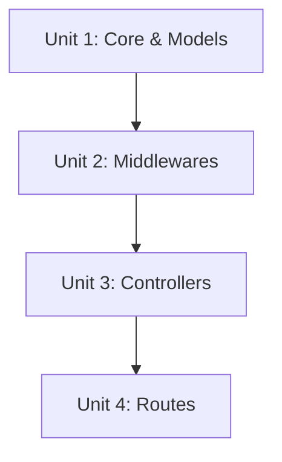

# Unit of Work Dependency Matrix

The units must be executed in sequence to ensure that each layer has the necessary types and dependencies from the underlying layers.

| Unit | Depends On | Reason |
|---|---|---|
| Unit 1: Core & Models | None | Foundational layer and runtime setup. |
| Unit 2: Middlewares | Unit 1 | Depends on Models for type definitions. |
| Unit 3: Controllers | Unit 1, Unit 2 | Depends on Models and Middlewares for logic. |
| Unit 4: Routes | Unit 3 | Depends on Controllers for route handling. |

## Dependency Graph

