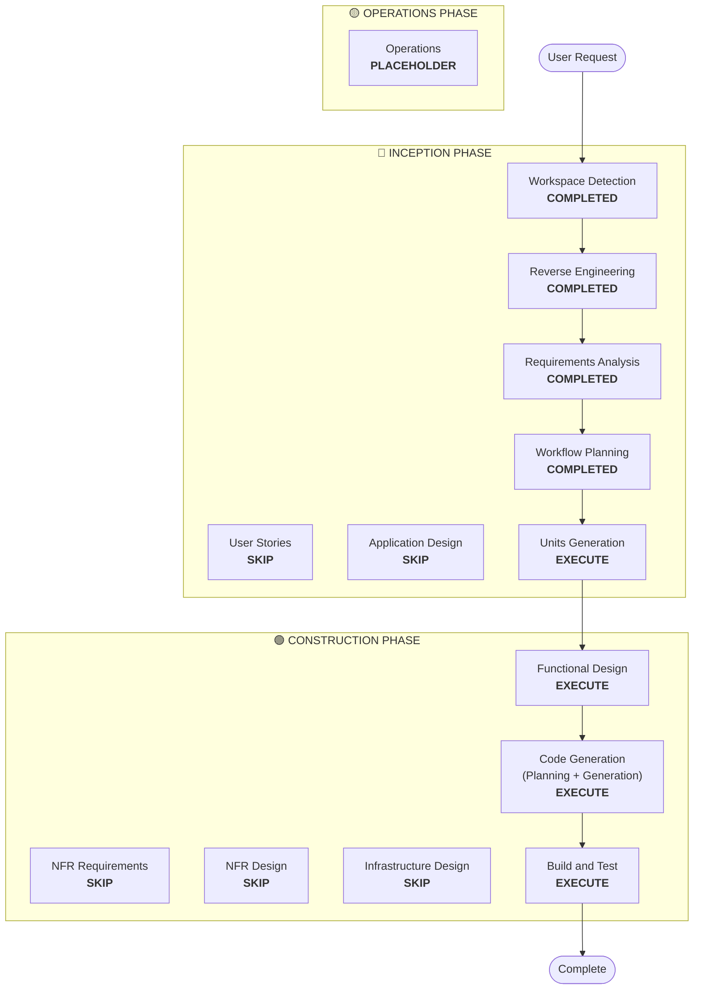

# Execution Plan

## Detailed Analysis Summary

### Transformation Scope (Brownfield Only)
- **Transformation Type**: Architectural & Codebase-wide Refactor
- **Primary Changes**: TypeScript migration, project-wide naming correction ("ressources" -> "resources"), and transition from `npm` to `bun`.
- **Related Components**: All routes, controllers, models, and core utilities.

### Change Impact Assessment
- **User-facing changes**: Yes - API URLs will change due to the naming correction (`/ressources` -> `/resources`).
- **Structural changes**: Yes - File extensions changing from `.js` to `.ts`, directory renaming.
- **Data model changes**: Yes - Mongoose schema naming and TypeScript interface definitions.
- **API changes**: Yes - Path renaming.
- **NFR impact**: Yes - Performance improvements from Bun and better maintainability from TypeScript.

### Risk Assessment
- **Risk Level**: Medium (High volume of changes, but technically straightforward)
- **Rollback Complexity**: Moderate (Git-based rollback)
- **Testing Complexity**: Moderate (Requires verifying all endpoints after renaming)

## Workflow Visualization

## Phases to Execute

### 🔵 INCEPTION PHASE
- [x] Workspace Detection (COMPLETED)
- [x] Reverse Engineering (COMPLETED)
- [x] Requirements Analysis (COMPLETED)
- [x] Workflow Planning (COMPLETED)
- [ ] Units Generation - EXECUTE
  - **Rationale**: Needed to break down the major overhaul into manageable units (e.g., Auth, Resources, Core).

### 🟢 CONSTRUCTION PHASE
- [ ] Functional Design - EXECUTE
  - **Rationale**: Needed to define the new TypeScript interfaces and the renamed schema structures.
- [ ] Code Generation - EXECUTE (ALWAYS)
  - **Rationale**: Implementation of TS migration and naming changes.
- [ ] Build and Test - EXECUTE (ALWAYS)
  - **Rationale**: Verify that the migration to Bun and the naming changes don't break functionality.

## Estimated Timeline
- **Total Phases**: 5 remaining stages
- **Estimated Duration**: 2-3 hours of active development

## Success Criteria
- **Primary Goal**: Full TypeScript migration and naming correction using Bun.
- **Key Deliverables**: Validated `.ts` codebase, `bun.lockb` file, renamed directories/routes.
- **Quality Gates**: `bun test` passes, `tsc` (type check) passes.
