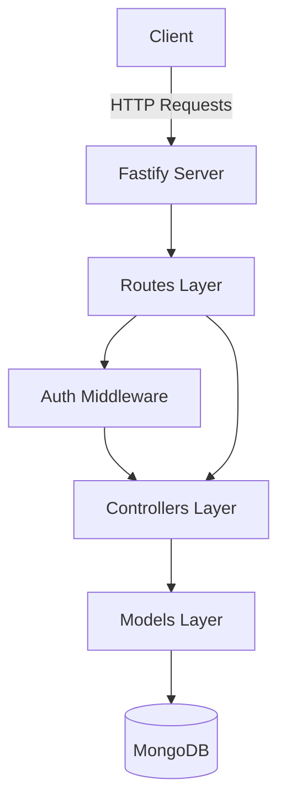
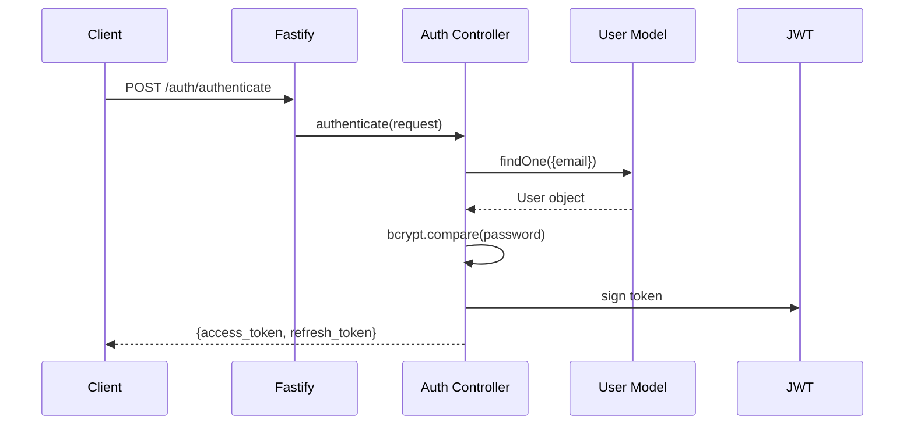

# System Architecture

## System Overview
The system is a Node.js API built with Fastify, using Mongoose for MongoDB interaction. It implements a layered architecture with routes, controllers, and models.

## Architecture Diagram

## Component Descriptions
### root
- **Purpose**: System entry and configuration.
- **Responsibilities**: Server initialization, DB connection, dependency registration.
- **Dependencies**: Fastify, Mongoose.
- **Type**: Application

### src/routes
- **Purpose**: Defines API endpoints and maps them to controllers.
- **Responsibilities**: Route registration, schema validation.
- **Dependencies**: Controllers, Fastify.
- **Type**: Application

### src/controllers
- **Purpose**: Contains business logic for each route.
- **Responsibilities**: Processing requests, interacting with models, returning responses.
- **Dependencies**: Models, Core Utils.
- **Type**: Application

### src/core/models
- **Purpose**: Defines data structures and persistence logic.
- **Responsibilities**: Schema definition, database queries.
- **Dependencies**: Mongoose.
- **Type**: Model

### src/core/middlewares
- **Purpose**: Intercepts requests for cross-cutting concerns.
- **Responsibilities**: Authentication validation (JWT).
- **Dependencies**: JWT, Models.
- **Type**: Application

## Data Flow

## Integration Points
- **External APIs**: None.
- **Databases**: MongoDB (via Mongoose).
- **Third-party Services**: None.

## Infrastructure Components
- **Deployment Model**: Local/Container (implied).
- **Networking**: Listens on port 3000.
