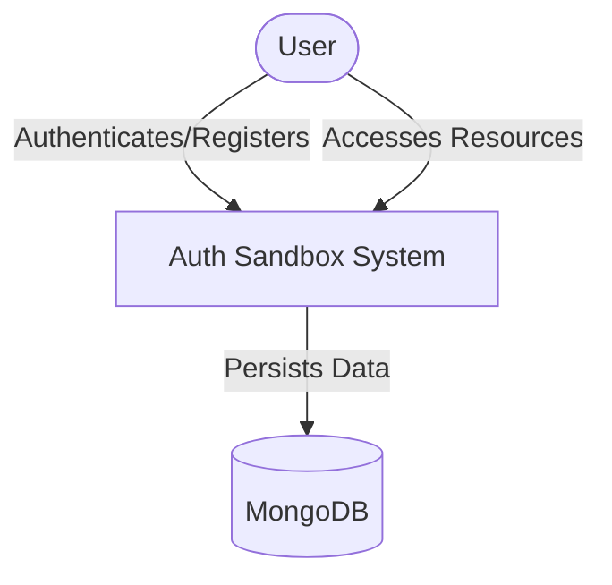

# Business Overview

## Business Context Diagram

## Business Description
- **Business Description**: A sandbox system for demonstrating basic authentication and OAuth-like flows using Fastify and MongoDB. It provides endpoints for user registration, authentication, and accessing restricted/unrestricted resources.
- **Business Transactions**:
    - **User Registration**: Creating a new user account with email and password.
    - **User Authentication**: Logging in to obtain an access token and refresh token.
    - **Resource Access**: Accessing public or restricted content based on authentication status.
    - **PKCE Generation**: Helper utility for generating PKCE (Proof Key for Code Exchange) parameters.
- **Business Dictionary**:
    - **Access Token**: A JWT used to authenticate requests to restricted resources.
    - **Refresh Token**: A token used to obtain a new access token without re-authenticating.
    - **Restricted Content**: Data that requires a valid access token to view.
    - **Unrestricted Content**: Data available to anyone.

## Component Level Business Descriptions
### Auth Controller
- **Purpose**: Handles user identity management.
- **Responsibilities**: Registration, login, token issuance, and validation.

### Resources Controller
- **Purpose**: Manages access to application content.
- **Responsibilities**: Serving restricted and unrestricted data.

### Helpers Controller
- **Purpose**: Provides utility functions for OAuth flows.
- **Responsibilities**: PKCE generation and callback handling.
