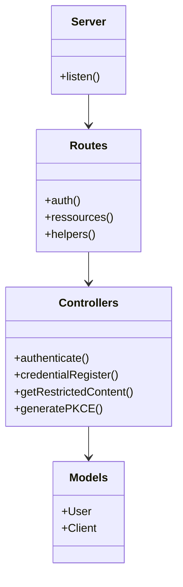

# Code Structure

## Build System
- **Type**: npm / bun
- **Configuration**: `package.json`, `tsconfig.json`, `bun.lock`

## Key Classes/Modules

### Existing Files Inventory
- `index.ts` - Main entry point, connects to DB and starts server.
- `server.ts` - Fastify server instance configuration and route registration.
- `src/controllers/auth.ts` - Authentication logic (login, register).
- `src/controllers/helpers.ts` - Helper logic (PKCE).
- `src/controllers/ressources.ts` - Resource delivery logic.
- `src/core/middlewares/authMiddleware.ts` - JWT verification middleware.
- `src/core/models/user.ts` - User schema and model.
- `src/core/models/client.ts` - Client schema and model.
- `src/routes/auth.ts` - Auth route definitions.
- `src/routes/helpers.ts` - Helper route definitions.
- `src/routes/ressources.ts` - Resource route definitions.
- `tests/index.test.ts` - Integration tests for the API.

## Design Patterns
### Singleton (Server)
- **Location**: `server.ts`
- **Purpose**: Ensure only one server instance is configured.
- **Implementation**: Factory function `server(opts)`.

### Middleware
- **Location**: `src/core/middlewares/`
- **Purpose**: Decouple authentication logic from routes.
- **Implementation**: Fastify `preHandler` hook.

### MVC (Simplified)
- **Location**: `src/`
- **Purpose**: Separate routing, logic, and data.
- **Implementation**: Folders for routes, controllers, and models.

## Critical Dependencies
### fastify
- **Version**: 5.8.4
- **Usage**: Web framework core.
- **Purpose**: Routing and HTTP handling.

### mongoose
- **Version**: 8.2.3
- **Usage**: MongoDB ODM.
- **Purpose**: Database interaction.

### jsonwebtoken
- **Version**: 9.0.3
- **Usage**: JWT handling.
- **Purpose**: Secure authentication.

### bcrypt
- **Version**: 6.0.0
- **Usage**: Password hashing.
- **Purpose**: Security.
