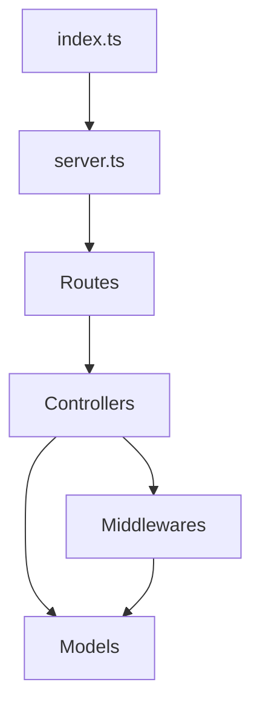

# Dependencies

## Internal Dependencies

### Server depends on Routes
- **Type**: Runtime
- **Reason**: To register endpoints.

### Routes depend on Controllers
- **Type**: Runtime
- **Reason**: To handle requests.

### Controllers depend on Models
- **Type**: Runtime
- **Reason**: To interact with the database.

## External Dependencies
### fastify
- **Version**: 5.8.4
- **Purpose**: Web framework.
- **License**: MIT

### mongoose
- **Version**: 8.2.3
- **Purpose**: MongoDB interaction.
- **License**: MIT

### jsonwebtoken
- **Version**: 9.0.3
- **Purpose**: Token-based authentication.
- **License**: MIT

### bcrypt
- **Version**: 6.0.0
- **Purpose**: Password hashing.
- **License**: MIT
